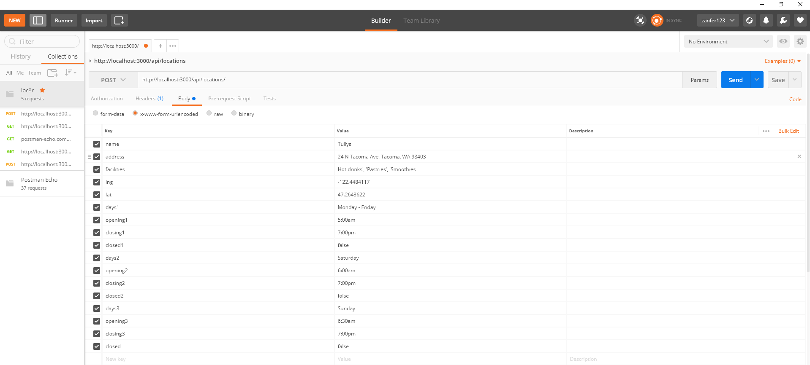
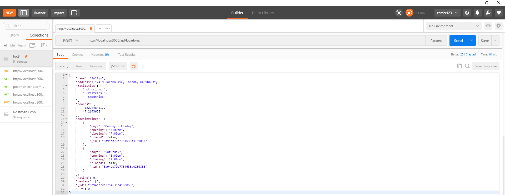
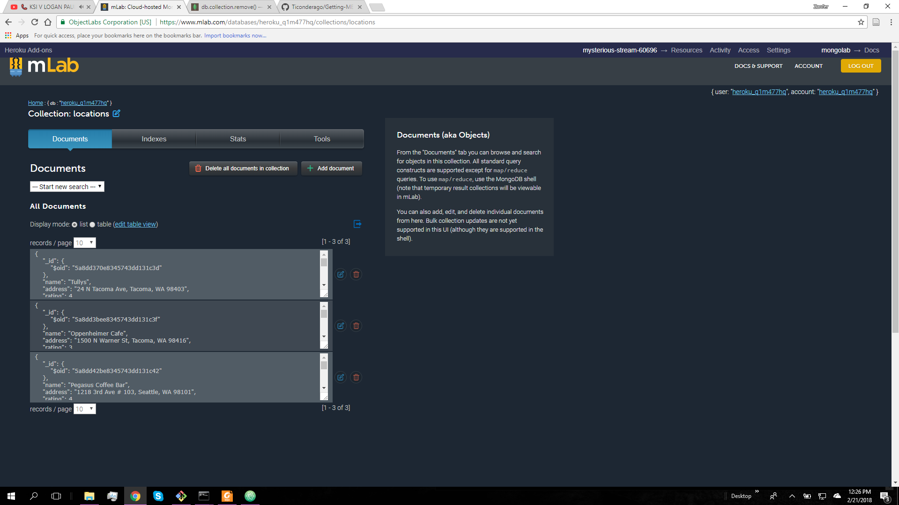
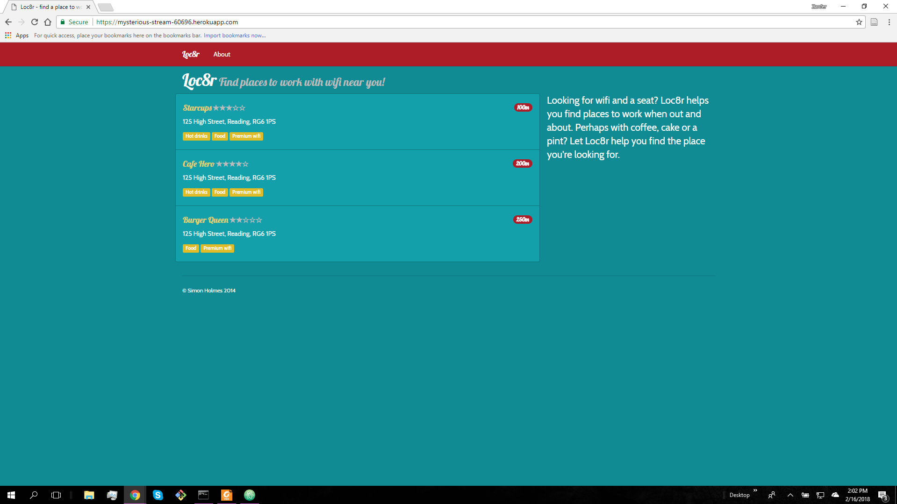

# Nathan Reinhardt Getting MEAN Project
## Chapter 6
Link - https://mysterious-stream-60696.herokuapp.com/

In Chapter 6 the book went into how to use api with html and json. This chapter setup
the skeleton for the active live database commands. The commands are there but they
don't interact with everything yet. I had trouble trying to figure out how postman and
my database connected. After finally seeing how they connected then I was able to
understand how the commands on postman worked. Everything else in the chapter worked
well for me. Just the postman connection learning took a bit.

1. When the function locationCreate gets called the services recieve a request at
   /api/locations
2. Making a request to an api is in JSON data format returned from the server.
3. Postman is used for testing an api which sends http requests and functions. 
   Useful for receiving requests. Different from web browsers because it can do more
   commands than just simple web browsers.

## Chapter 5
Link - https://mysterious-stream-60696.herokuapp.com/

In Chapter 5 the book went into how to set up a local and live database for the website.
It was pretty fun having a ton of console windows open performing different actions while
creating the databases.  The hardest part for me was getting my dumped data pushed up to the
live database. I had the right credentials for the data, but I kept getting Authentication
Errors which meant either my databse host was typed wrong or the username and password could
have been wrong. Went through each one at a time to see which one gave the error. I got it
randomly entering the same information, so it could have been a one off error while typing.
Now the database has been set.

1. Database entries in MongoDB are called documents.
2. The difference between mongod and mongo are huge. mongod runs the database in the
   background in the machine, while mongo is the shell that allows you access to work with
   mongod.
3. Heroku needs MLab to access our live database for Heroku. We can only run it locally
   without MLab.

## Chapter 4
Link - https://mysterious-stream-60696.herokuapp.com/

In Chapter 4, the website is now starting to have proper formatting. After finishing
Chapter 4, I have built a better understanding on how a website can be formatted
and getting really familiar with .jade files. The most challenging part was debugging
the .jade files. The debugging most of the time came down to indentation errors. 
In the book on page 99, there is a small error. It shows location-info.js instead of
the correct location-info.jade (listing 4.7). The error can crash the page since it
is the wrong file type. This chapter also went in depth in the controllers and views folders.
Created multiple views for new pages to navigate to.

1. This layout allows to have mixin code that gets called. A mixin is a function that can
   be called through out the code.
2. The location page routes to location-info.jade in the views folder. This file calls the
   outputRating function which is stored in includes. This is called a mixin.
3. Express provides the routing functionality. This is front end functionality.

## Chapter 3
Link - https://mysterious-stream-60696.herokuapp.com/

In Chapter 3 we have a very basic setup for a webpage.  Most of this chapter taught
the basics of using these new tools given at our disposal. Challenges that I had was
making sure app_server was being set correctly cause I remember seting it correctly 
at first, but for some reason it didnt save those changes so my bootstrap was not giving
off the proper theme. Seting everything up on a new device is probably the most
challenging concept to do well.

1. This process is called routing. The code that connects a URL request to the controller code
   is called route.
2. When you want to add an external module you use the command npm install.
3. It appears in the console screen.
