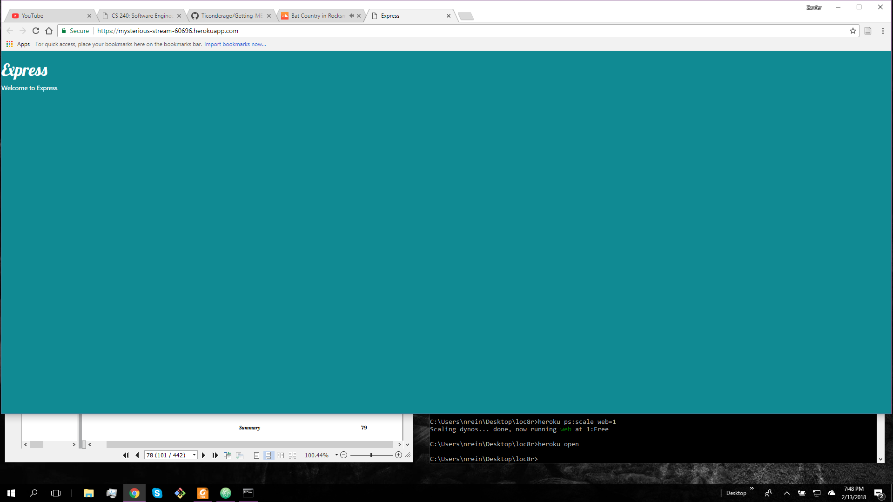

# Nathan Reinhardt Getting MEAN Project
## Chapter 3
Link - https://mysterious-stream-60696.herokuapp.com/

In Chapter 3 we have a very basic setup for a webpage.  Most of this chapter taught
the basics of using these new tools given at our disposal. Challenges that I had was
making sure app_server was being set correctly cause I remember seting it correctly 
at first, but for some reason it didnt save those changes so my bootstrap was not giving
off the proper theme. Seting everything up on a new device is probably the most
challenging concept to do well.

1. This process is called routing. The code that connects a URL request to the controller code
   is called route.
2. 
